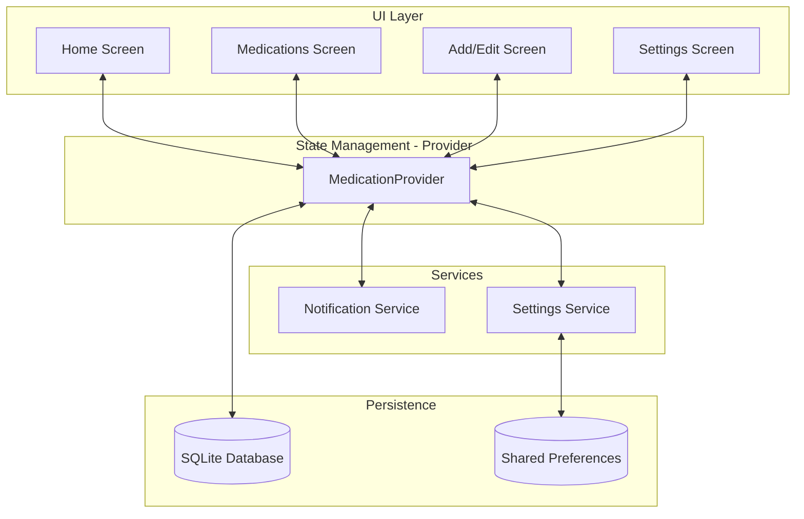
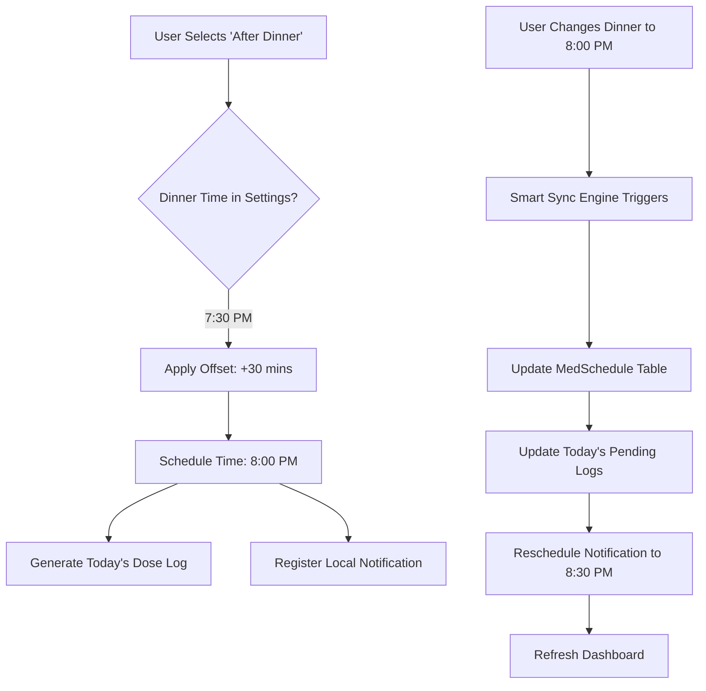

# 💊 MedTime - Smart Medication Manager

**MedTime** is a premium, high-density medication management application designed for elderly patients and power users who manage complex daily regimens. It focuses on minimalist aesthetics, extreme space efficiency, and intuitive meal-based scheduling.

---

## 🚀 Key Features

- **🍱 High-Density Dashboard**: Grouped view of daily medications by time slot (e.g., "After Dinner") to reduce scrolling.
- **🍴 Meal-Based Scheduling**: Intuitively link medications to meal times (Breakfast, Lunch, Dinner, Bed) with automatic offsets.
- **⏰ Smart Sync Engine**: Changing your dinner time in settings automatically recalculates and updates all associated medication reminders and dashboard logs.
- **🏙️ Minimalist UI**: Ultra-compact cards showing names, dosages, and full timing schedules in a single row.
- **📸 Visual Identification**: Support for pill photos and color-coding for quick recognition.
- **📴 100% Offline**: Privacy-first design with local SQLite storage and local notifications.

---

## 🏗️ Architecture

The app follows a clean, provider-based state management pattern to ensure data consistency and reactive UI updates.



---

## 🧠 Smart Scheduling Logic

MedTime uses a relative scheduling system. Instead of hardcoding times, it links medications to "Life Events" (Meals).



---

## 🛠 Tech Stack

- **Framework**: [Flutter](https://flutter.dev/)
- **State Management**: [Provider](https://pub.dev/packages/provider)
- **Database**: [Sqflite](https://pub.dev/packages/sqflite) (Local Persistence)
- **Notifications**: [flutter_local_notifications](https://pub.dev/packages/flutter_local_notifications)
- **Animations**: [animate_do](https://pub.dev/packages/animate_do)
- **Icons**: Material Icons Rounded

---

## 📦 Getting Started

### Prerequisites
- Flutter SDK (latest stable)
- Android Studio / VS Code with Flutter extensions

### Installation
1. Clone the repository:
   ```bash
   git clone <repository-url>
   ```
2. Install dependencies:
   ```bash
   flutter pub get
   ```
3. Run the app:
   ```bash
   flutter run
   ```

### Building Release APK
To generate a production-ready APK:
```bash
flutter build apk --release
```

---

## 🎨 Design Philosophy
- **Accessibility**: High-contrast text and large tap targets for elderly users.
- **Density**: Use every pixel efficiently. Long lists of medications should be readable without excessive scrolling.
- **Minimalism**: Remove clutter. Focus on the *next dose*.

---

*Developed with ❤️ for better health management.*
